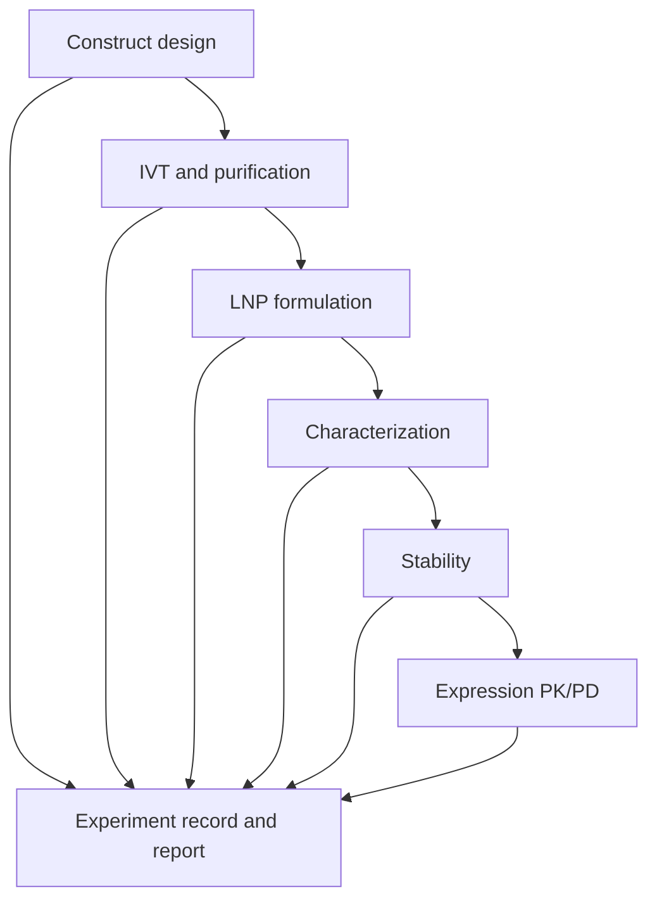

# mRNAtoolkit

## Combined Product Vision, Scientific Specification, Architecture, and Development Roadmap

**Working tagline:** The reproducible computational companion for the mRNA–LNP workflow—from sequence to vial.

**Document status:** Project specification and implementation roadmap  
**Initial target release:** v0.1  
**Primary audience:** mRNA and lipid-nanoparticle formulation researchers, analytical scientists, graduate students, and computational formulation scientists

---

## 1. Executive summary

`mRNAtoolkit` should be developed as a reproducible research workspace for mRNA–LNP development, not merely as a collection of independent scientific calculators.

The package should ultimately connect the major stages of an mRNA–LNP experiment:

1. construct design;
2. in vitro transcription (IVT) and purification;
3. LNP formulation and process planning;
4. physicochemical and analytical characterization;
5. stability assessment;
6. mRNA delivery and protein-expression modeling;
7. standardized experiment recording and reporting.

The unifying feature is a common experiment record that connects inputs, processing conditions, analytical measurements, assumptions, uncertainty, provenance, and outputs. This creates a continuous digital thread through the workflow and produces clean, machine-readable data that could later support `DeliveryBench`, LNP-ML models, QbD studies, and cross-study benchmarking.

However, the complete ontology should not be designed before the first real workflows exist. Development should begin with two concrete, experimentally verifiable workflows:

- `plan_batch()`: a complete mRNA–LNP formulation and microfluidic-mixing planner;
- `analyze_ribogreen_plate()`: raw plate-reader analysis for RNA concentration, encapsulation efficiency, and recovery.

These workflows should use a minimal typed record consisting of `BatchPlan`, `AssayRun`, `Result`, and `Provenance`. The fuller sequence-to-vial schema should evolve from real data requirements in subsequent releases.

CUDA and GPU support should not ship in v0.1. The initial calculations are scalar or small-array operations and will not benefit meaningfully from GPU execution. GPU dependencies should be added only when a specific neural model, differentiable sequence optimizer, large Monte Carlo simulation, or population PK/PD workload has been implemented and benchmarked.

The initial positioning should therefore be:

> A verified, open-source mRNA–LNP batch-planning and raw-assay analysis toolkit built around reproducible, machine-readable experimental records.

The term **verified** is intentional. The software should not be described as validated or regulatory-grade until an intended use, formal requirements, documented validation protocol, change control, and appropriate evidence have been established.

---

## 2. Strategic rationale

### 2.1 The unmet need

Many mRNA–LNP researchers still perform formulation calculations, dilution planning, plate analysis, and batch comparisons in personal spreadsheets. These workflows are often:

- difficult to reproduce;
- weakly documented;
- inconsistent in units and terminology;
- disconnected from raw data;
- vulnerable to transcription and dilution-factor errors;
- unsuitable for direct reuse in computational or ML studies.

Existing web calculators can perform isolated lipid or N/P calculations, but they rarely connect formulation planning, assay analysis, provenance, uncertainty, and structured data export.

### 2.2 Portfolio value

The project creates a deliberate two-track scientific portfolio:

- **Deterministic research software:** reproducible formulation, assay, stability, and modeling workflows that remain useful without model retraining or paid APIs.
- **Research and ML infrastructure:** standardized records that can later feed DeliveryBench, LNP property-prediction models, sequence models, and cross-study evaluation.

This positioning is especially strong for computational formulation-science roles because it demonstrates wet-lab understanding, quantitative modeling, software engineering, analytical rigor, and awareness of pharmaceutical development requirements.

### 2.3 The principal differentiator

The moat is not the N/P equation. It is the combination of:

- complete workflows rather than isolated functions;
- raw-data ingestion;
- explicit units and assumptions;
- uncertainty and quality-control checks;
- provenance and auditability;
- batch-level reports;
- machine-readable exports;
- interoperability with future modeling datasets.

---

## 3. Product principles

1. **Workflow over calculator:** expose researcher-level tasks such as planning a batch or analyzing a plate.
2. **Raw data over copied values:** accept instrument exports whenever practical.
3. **Units are explicit:** user-facing inputs and stored records must carry units.
4. **Assumptions are visible:** approximate calculations must state their assumptions.
5. **No silent coercion:** invalid, ambiguous, or physically impossible inputs must fail clearly.
6. **Serializable by default:** public result objects must export cleanly to JSON and CSV.
7. **CPU-first:** the default installation must run on a normal laptop.
8. **Optional dependencies are earned:** no GPU, ML, folding, plotting, or document dependency should be added before a real feature requires it.
9. **Reproducible, not regulatory by assertion:** reports should disclose software version, methods, inputs, and verification status.
10. **Human-in-the-loop:** the package supports scientific planning and analysis; it does not replace experimental judgment.

---

## 4. End-state sequence-to-vial workflow



The package should eventually support the following stations.

| Stage | Subpackage | Intended scope |
|---|---|---|
| Design | `construct` | Full transcript representation, CDS checks, UTRs, Kozak context, uORFs, motifs, GC windows, codon metrics, poly(A), and optional folding adapters |
| Manufacture | `ivt` | DNA-template planning, T7 promoter, IVT inputs, capping and poly(A) records, purification, impurities, yield, recovery, and mass balance |
| Formulate | `formulate` | N/P calculations, lipid composition, stock recipes, FRR/TFR, pump settings, losses, overfill, dilution, and buffer-exchange planning |
| Characterize | `characterize` | RiboGreen, standard curves, DLS, PDI, zeta potential, apparent pKa, RNA integrity, assay QC, and batch comparison |
| Stabilize | `stability` | Size/PDI drift, potency or integrity loss, freeze–thaw analysis, kinetic models, Arrhenius analysis, and uncertainty |
| Express | `express` | mRNA decay, translation, protein turnover, secretion, uptake, endosomal escape, and future PK/PD extensions |
| Record | `experiment` | Typed records, provenance, units, links to raw files, software version, assumptions, and exports |
| Report | `report` | Reproducible Markdown, CSV, JSON, plots, and later optional PDF or DOCX output |

---

## 5. Scope of v0.1

### 5.1 Flagship workflow A: `plan_batch()`

#### Objective

Convert a desired mRNA–LNP batch specification into a complete, internally reconciled formulation worksheet.

#### Required inputs

- target RNA mass or final RNA concentration;
- final batch volume or number of target vials/doses;
- fill volume per vial, where applicable;
- expected process recovery;
- planned overage or overfill;
- target N/P ratio;
- RNA representation: average nucleotide molecular weight or optional exact sequence-aware mode;
- ionizable-lipid identity, molecular weight, ionizable groups per molecule, mol%, and stock concentration;
- helper lipid, cholesterol, and PEG-lipid identities, molecular weights, mol%, and stock concentrations;
- aqueous-to-organic flow-rate ratio (FRR);
- total flow rate (TFR) or individual flow rates;
- initial aqueous and organic concentrations;
- planned post-mixing dilution or buffer-exchange parameters.

#### Required calculations

- RNA phosphate amount;
- ionizable-lipid amount needed for the target N/P ratio;
- total lipid amount implied by the ionizable-lipid molar fraction;
- per-component lipid amount, mass, and stock volume;
- aqueous and organic phase volumes;
- aqueous and organic flow rates;
- mixing time;
- ethanol fraction at the mixing junction;
- theoretical RNA and total-lipid concentrations;
- overage and process-loss adjustment;
- post-mixing dilution requirement;
- buffer-exchange or concentration-factor estimate;
- fill-volume reconciliation;
- complete input/output mass balance.

#### Required outputs

- human-readable batch worksheet;
- machine-readable `BatchPlan` record;
- warnings and assumptions;
- CSV and JSON exports;
- Markdown report;
- calculation trace showing equations and canonical units.

#### Important scientific distinctions

- FRR must be defined explicitly as aqueous:organic or organic:aqueous. The package should never infer the convention silently.
- TFR and FRR together determine individual stream flow rates.
- The ethanol fraction at the junction is not necessarily the ethanol level after dilution, dialysis, or TFF.
- A mass-based RNA-phosphate approximation should be clearly labeled as approximate.
- Sequence-aware calculations should account for transcript length and, where supported, modified nucleotide composition.
- The number of nominal amines in a lipid and the number of relevant ionizable groups are not always interchangeable; the user must be able to provide the effective count used for the calculation.

### 5.2 Flagship workflow B: `analyze_ribogreen_plate()`

#### Objective

Analyze a raw plate-reader export and plate map to estimate RNA concentration, encapsulation efficiency, encapsulation yield or recovery, and associated quality-control metrics.

#### Required inputs

- raw CSV or XLSX plate-reader data;
- explicit plate map;
- standard concentrations and units;
- blank wells;
- free-RNA sample wells;
- lysed/total-RNA sample wells;
- sample and standard dilution factors;
- technical-replicate assignments;
- optional batch identifiers and surfactant details;
- optional calibration-model choice and weighting.

#### Analysis pipeline

1. validate the plate map and well identifiers;
2. detect missing, duplicated, or conflicting assignments;
3. subtract appropriate blanks;
4. aggregate or retain standard replicates;
5. fit the selected calibration model;
6. calculate residuals and goodness-of-fit;
7. check standards and samples against the calibrated range;
8. apply dilution factors;
9. convert fluorescence to RNA concentration;
10. calculate free and total RNA;
11. calculate encapsulated RNA and EE%;
12. calculate RNA recovery or encapsulation yield when initial RNA input is available;
13. propagate uncertainty or construct confidence intervals;
14. flag failed or questionable QC conditions;
15. generate plots and structured results.

#### Required outputs

- calibration coefficients and model metadata;
- standard-curve plot;
- residual plot;
- replicate summary;
- calculated free, total, and encapsulated RNA;
- EE%, recovery, and uncertainty;
- calibration-range and QC warnings;
- machine-readable `AssayRun` and `Result` records;
- Markdown, CSV, and JSON outputs.

#### Scientific limitations to disclose

- Directly applying `(total signal - free signal) / total signal` is only appropriate when signals are comparable, blanks and dilution are controlled, and responses remain in the valid calibration range.
- RiboGreen measures dye-accessible RNA and does not establish that the RNA is full-length or biologically functional.
- LNP composition, surfactant, timing, and other matrix effects can affect fluorescence.
- High EE% alone does not establish high potency, stability, or appropriate biodistribution.

---

## 6. Minimal v0.1 data model

The initial release should avoid a complete sequence-to-vial ontology while still enforcing stable, serializable outputs.

### 6.1 `Provenance`

Suggested fields:

- software name and version;
- workflow name and version;
- generation timestamp;
- raw source-file names and checksums;
- operator or analyst, when supplied;
- method identifier;
- equations or calculation version;
- assumptions;
- warnings;
- optional instrument metadata.

### 6.2 `BatchPlan`

Suggested sections:

- batch identifier;
- target specification;
- RNA input;
- lipid components;
- stock solutions;
- aqueous phase;
- organic phase;
- mixing settings;
- downstream processing;
- theoretical outputs;
- mass-balance summary;
- warnings;
- provenance.

### 6.3 `AssayRun`

Suggested sections:

- assay identifier;
- assay type;
- batch/sample identifiers;
- raw-data reference;
- plate map;
- calibration configuration;
- dilution scheme;
- replicate configuration;
- reagent and surfactant metadata;
- QC rules;
- provenance.

### 6.4 `Result`

Suggested fields:

- result name;
- numeric value;
- unit;
- uncertainty or confidence interval;
- replicate count;
- method;
- QC status;
- warnings;
- assumptions;
- provenance link.

### 6.5 Units strategy

Use a unit library such as Pint at the input, record, and output boundaries. Convert values to documented canonical numeric units before entering computational kernels. This preserves dimensional safety without leaking unit objects into every arithmetic operation.

Recommended canonical internal units include:

- mass: µg;
- amount: nmol;
- volume: mL;
- concentration: mg/mL or µg/mL, selected consistently by context;
- flow: mL/min;
- time: min;
- temperature: °C for records and K where required by equations.

---

## 7. Proposed v0.1 package architecture

```text
mrnatoolkit/
├── core/
│   ├── models.py
│   ├── units.py
│   ├── provenance.py
│   ├── exceptions.py
│   └── validation.py
├── formulate/
│   ├── batch.py
│   ├── np_ratio.py
│   ├── composition.py
│   ├── stocks.py
│   ├── mixing.py
│   └── mass_balance.py
├── characterize/
│   ├── calibration.py
│   ├── plate_map.py
│   ├── ribogreen.py
│   └── qc.py
├── io/
│   ├── plate_reader.py
│   ├── json_io.py
│   └── csv_io.py
├── report/
│   ├── markdown.py
│   └── plots.py
├── cli.py
└── __init__.py
```

The internal arithmetic should remain composed of small, independently testable functions, but users should normally interact with the workflow-level API.

Example:

```python
from mrnatoolkit import plan_batch, analyze_ribogreen_plate

plan = plan_batch(
    rna_mass="100 ug",
    target_np=6,
    lipid_composition={
        "ionizable": {"mol_percent": 50.0, "mw": "710 g/mol", "stock": "10 mg/mL"},
        "helper": {"mol_percent": 10.0, "mw": "790 g/mol", "stock": "10 mg/mL"},
        "cholesterol": {"mol_percent": 38.5, "mw": "386.65 g/mol", "stock": "10 mg/mL"},
        "peg_lipid": {"mol_percent": 1.5, "mw": "2500 g/mol", "stock": "5 mg/mL"},
    },
    frr="3:1 aqueous:organic",
    total_flow_rate="12 mL/min",
    expected_recovery=0.80,
)

assay = analyze_ribogreen_plate(
    data="plate_reader.csv",
    plate_map="plate_map.csv",
    calibration="linear",
    weighting=None,
)
```

---

## 8. Corrections required in the existing scaffold

The existing prototype is a useful proof of concept, but it should not be released without the following changes.

### 8.1 Formulation calculations

- Reject negative RNA mass, lipid amount, molecular weight, concentration, mol%, and volume.
- Reject zero RNA mass when calculating N/P.
- Reject empty component collections and zero total molar composition.
- Detect duplicate component names instead of silently overwriting dictionary entries.
- Return both user-entered and normalized mol%.
- Distinguish nominal mol% from the normalized composition used in calculations.
- Support approximate mass-based and optional sequence-aware phosphate calculations.
- Document the effective ionizable-group assumption.
- Require an explicit FRR convention.
- Support TFR and derive both pump flow rates.
- Add recovery, overage, dilution, and mass-balance reconciliation.

### 8.2 Calibration and assay analysis

- Do not return a prediction closure inside the result dictionary because closures are not JSON-serializable.
- Use a serializable calibration model containing coefficients, domain, fit statistics, and prediction methods.
- Validate equal-length and finite calibration arrays.
- Support replicates and optional weighting.
- Report residuals and calibration range.
- Detect zero or near-zero slope.
- Prevent division by zero.
- Flag physically implausible EE values rather than silently returning them.
- Separate raw signal, blank-corrected signal, calculated concentration, and dilution-corrected concentration.

### 8.3 DLS terminology

The existing `span(D10, D50, D90)` helper is insufficient as the characterization layer. A future DLS module should support:

- Z-average diameter;
- cumulants PDI;
- replicate mean, SD, CV, and acceptance rules;
- intensity-weighted distributions;
- careful handling of volume- and number-transformed distributions;
- instrument metadata and viscosity/refractive-index settings;
- explicit distinction between percentile span and cumulants PDI.

The statement “lower span means more monodisperse” should be qualified rather than treated as a complete DLS interpretation.

### 8.4 Reporting terminology

The initial Markdown accumulator should be described as a reproducible report generator, not a regulatory-style reporting system. Reports should eventually include:

- equations;
- units;
- assumptions;
- raw-data references;
- uncertainty;
- warnings and QC status;
- software and workflow versions;
- verification status;
- method identifiers;
- analyst-supplied metadata;
- change history where applicable.

---

## 9. Verification, validation, and quality strategy

### 9.1 Terminology

- **Verification:** evidence that the software implements its specified calculations correctly.
- **Validation:** evidence that the software is fit for a clearly defined intended use under controlled conditions.

v0.1 should be verified extensively but should not claim formal validation.

### 9.2 Required v0.1 testing

#### Unit tests

- every equation;
- unit conversion;
- inverse and round-trip calculations;
- flow-rate derivation;
- dilution factors;
- calibration fitting;
- EE and recovery calculations;
- serialization and deserialization.

#### Property-based tests

- mass is conserved within specified tolerances;
- component nmol sums equal total lipid nmol;
- normalized mol% sums to 100%;
- increasing target RNA mass proportionally increases required phosphate and lipid under fixed assumptions;
- N/P forward and inverse functions round-trip;
- calculated aqueous and organic flows sum to TFR;
- calculated stream-volume ratio matches FRR;
- JSON export and import preserve results.

#### Invalid-input tests

- negative or zero molecular weight;
- negative mass or volume;
- missing standards;
- duplicated plate wells;
- unknown plate labels;
- zero calibration slope;
- non-finite signals;
- samples outside the calibration range;
- invalid FRR convention;
- duplicate lipid names;
- zero total mol%.

#### Reference verification

- independently hand-calculated cases;
- published example formulations where inputs are fully reported;
- comparison with trusted laboratory worksheets;
- blind recalculation by a second person;
- dimensional analysis of every public equation.

### 9.3 Later formal validation

If the package is eventually used in controlled development workflows, formal validation would require:

- an intended-use statement;
- user and software requirements;
- risk assessment;
- traceability matrix;
- installation and operational qualification approach, where applicable;
- locked verification datasets;
- documented acceptance criteria;
- change control;
- versioned calculation methods;
- audit-trail and record-retention decisions.

---

## 10. CUDA and computational backend decision

### 10.1 v0.1 decision

Remove the current CuPy dependency and generic `_backend.py` abstraction from v0.1.

The initial workload consists mostly of:

- scalar formulation arithmetic;
- small standard-curve fits;
- modest plate matrices;
- report generation.

GPU transfer, packaging, driver, and maintenance costs would outweigh any computational benefit.

### 10.2 Correction regarding RNA folding

ViennaRNA's Python API calls its compiled folding implementation. Substituting CuPy for NumPy does not accelerate `RNA.fold_compound(...).mfe()`.

RNA dynamic-programming algorithms are not absolutely incapable of parallelization, but GPU acceleration requires a purpose-built parallel implementation, a different folding engine, or a neural surrogate. Practical batch acceleration with ViennaRNA would more naturally begin with CPU multiprocessing across independent sequences.

### 10.3 Legitimate future GPU workloads

CUDA may be justified for:

- neural mRNA degradation or stability prediction;
- expression or delivery models;
- differentiable multi-objective sequence optimization;
- large candidate-sequence scoring;
- large Monte Carlo uncertainty propagation;
- Bayesian surrogate models;
- population PK/PD simulation;
- generative lipid or sequence models.

### 10.4 Dependency strategy

Do not publish a GPU extra until an accelerated feature exists and is benchmarked.

Potential future extras:

```toml
[project.optional-dependencies]
plate = ["pandas", "openpyxl"]
plot = ["matplotlib"]
seq = ["biopython"]
fold = ["ViennaRNA"]
ml = ["torch"]
dev = ["pytest", "hypothesis", "ruff", "mypy"]
```

If a later non-ML simulation genuinely benefits from CuPy, provide a CUDA-version-specific extra and benchmark it per operation. Do not use an arbitrary universal array-size threshold.

---

## 11. v0.2: IVT and the fuller experiment spine

The IVT layer is essential to making “sequence to vial” scientifically defensible.

### 11.1 Proposed IVT capabilities

- DNA-template representation;
- promoter and transcription-start context;
- linearization planning and recordkeeping;
- transcript-region representation: 5′ UTR, CDS, 3′ UTR, and poly(A);
- canonical and modified nucleotide composition;
- theoretical transcript molecular weight;
- IVT reagent calculation;
- reaction-volume planning;
- theoretical versus measured yield;
- capping strategy and capping-efficiency records;
- poly(A) strategy, target length, and measured distribution;
- DNase treatment record;
- purification method and recovery;
- concentration and integrity measurements;
- dsRNA, truncated transcript, residual DNA, protein, and other impurity records;
- RNA mass balance across manufacturing steps.

### 11.2 Important representation principle

The software should distinguish:

- the DNA template sequence;
- the intended RNA sequence;
- non-sequence chemical attributes such as cap identity;
- poly(A) tail strategy and measured distribution;
- modified-nucleotide identities;
- measured product quality attributes.

Not every relevant attribute can or should be encoded as a simple RNA string.

### 11.3 Expanded experiment record

After v0.1 workflows have stabilized, introduce:

```python
Experiment(
    construct=ConstructRecord(...),
    ivt=IVTBatch(...),
    formulation=LNPBatch(...),
    process=MixingProcess(...),
    assays=[DLSResult(...), RiboGreenResult(...), TNSResult(...)],
    stability=StabilityStudy(...),
    expression=ExpressionStudy(...),
)
```

The schema should be driven by the information actually required by working workflows, not by an attempt to model the entire field in advance.

---

## 12. Later flagship workflows

### 12.1 `fit_apparent_pka()`

Planned capabilities:

- raw TNS fluorescence or pH-dependent zeta-potential input;
- blank and baseline correction;
- normalized and absolute-signal modes;
- nonlinear Henderson–Hasselbalch-type fitting;
- baseline and amplitude parameters;
- apparent pKa with confidence interval;
- residual diagnostics;
- comparison across batches;
- pI interpolation from zeta-potential data;
- explicit model assumptions and fit limitations.

### 12.2 `compare_batches()`

Planned inputs:

- lipid composition;
- N/P;
- FRR and TFR;
- RNA and lipid concentrations;
- size, PDI, and zeta potential;
- EE and RNA recovery;
- apparent pKa;
- integrity and impurity measurements;
- stability observations;
- expression or potency.

Planned outputs:

- batch-comparison plots;
- replicate variability;
- control charts;
- drift detection;
- CPP–CQA association summaries;
- correlation matrices with appropriate warnings;
- tidy ML-ready tables;
- provenance-preserving combined records.

### 12.3 `fit_expression_kinetics()`

Begin with a transparent minimal model:

\[
\frac{dM}{dt}=-k_mM
\]

\[
\frac{dP}{dt}=k_{tl}M-k_pP
\]

where:

- \(M\) is functional cytosolic mRNA;
- \(P\) is translated protein;
- \(k_m\) is the mRNA degradation-rate constant;
- \(k_{tl}\) is the translation-rate constant;
- \(k_p\) is the protein-loss or degradation-rate constant.

Later extensions may include:

- LNP uptake;
- endosomal compartments;
- endosomal escape;
- cytosolic release;
- translation delay;
- protein secretion;
- tissue compartments;
- route effects;
- hierarchical fitting across formulations;
- uncertainty and identifiability analysis.

The module should begin with interpretable models before attempting PBPK or complex neural alternatives.

### 12.4 Stability analysis

Planned capabilities:

- longitudinal size and PDI drift;
- RNA integrity and potency loss;
- aggregation-rate modeling;
- freeze–thaw cycle analysis;
- formulation comparison;
- Arrhenius analysis where scientifically appropriate;
- uncertainty intervals;
- explicit warnings against unjustified shelf-life extrapolation.

---

## 13. Construct and sequence module

The construct module should complement, not duplicate, an existing codon optimizer.

Potential capabilities:

- structured full-transcript representation;
- CDS validation and translation;
- start and stop codon checks;
- Kozak-context assessment;
- upstream ORF detection;
- 5′ and 3′ UTR annotation;
- poly(A) metadata;
- GC content and sliding-window analysis;
- CpG and selected sequence-motif flagging;
- restriction-site and cloning checks;
- uridine-content summaries;
- optional modified-nucleotide representation;
- adapters to ViennaRNA for MFE, ensemble, and accessibility analysis;
- batch execution using CPU multiprocessing;
- optional future stability and expression models.

Predicted folding energy, motifs, GC content, and codon metrics should be presented as design descriptors, not definitive measures of in-vial stability, innate immunogenicity, translation, or therapeutic performance.

---

## 14. User interfaces

### 14.1 Python API

The Python API is the canonical interface and should expose typed workflow inputs and outputs.

### 14.2 Command-line interface

Suggested commands:

```bash
mrnatoolkit plan-batch batch.yaml --out results/
mrnatoolkit analyze-ribogreen plate.csv --map plate_map.csv --out results/
mrnatoolkit verify-record results/batch-plan.json
mrnatoolkit render-report results/batch-plan.json --format markdown
```

### 14.3 Notebook examples

Provide notebooks for:

- planning a four-component LNP formulation;
- processing a complete RiboGreen plate;
- comparing manual and toolkit calculations;
- exporting a tidy dataset for statistical or ML analysis.

### 14.4 Future graphical interface

A lightweight web interface may later serve non-programmers, but it should call the same tested Python workflows rather than reimplementing scientific calculations.

---

## 15. Documentation requirements

The documentation should include:

- scientific scope and limitations;
- unit conventions;
- equations and assumptions;
- worked examples;
- raw example datasets;
- plate-map templates;
- verification cases;
- API reference;
- CLI reference;
- interpretation guidance;
- troubleshooting;
- change log;
- citation instructions;
- explicit non-regulatory disclaimer.

Each workflow page should answer:

1. What scientific question does the workflow address?
2. What inputs are required?
3. What assumptions are made?
4. What equations are used?
5. What QC checks are applied?
6. What outputs are generated?
7. What should not be inferred from the output?

---

## 16. Release roadmap

| Release | Main deliverables | Exit criterion |
|---|---|---|
| **v0.1** | `plan_batch()`, `analyze_ribogreen_plate()`, minimal typed records, CLI, Markdown/CSV/JSON export, verification suite | Complete example workflows reproduce independent reference calculations and handle defined invalid inputs |
| **v0.2** | IVT planning and mass balance, construct representation, expanded experiment record | Demonstration from construct definition through purified RNA and LNP batch planning |
| **v0.3** | DLS replicate analysis, apparent pKa fitting, batch comparison, control charts | Multi-batch CQA case study with raw-data-to-report reproducibility |
| **v0.4** | Stability and expression-kinetics modules | Verified kinetic examples with uncertainty and identifiability reporting |
| **v0.5** | ML adapters and optional GPU acceleration for specific workloads | Benchmarked accelerated feature with transparent CPU fallback and documented model limits |

### Suggested implementation order within v0.1

1. write scientific requirements and canonical equations;
2. create minimal models and unit-boundary utilities;
3. implement and test core formulation primitives;
4. build `plan_batch()` around those primitives;
5. implement plate-map and plate-reader import;
6. build serializable calibration models;
7. implement `analyze_ribogreen_plate()`;
8. add QC plots and reports;
9. create reference datasets and verification notebooks;
10. package, document, and run clean-environment installation tests.

---

## 17. Definition of done for v0.1

v0.1 is ready for public release only when:

- both flagship workflows run from Python and the CLI;
- every public result is JSON-serializable;
- units and assumptions are visible in inputs and outputs;
- mass-balance and round-trip properties are tested;
- invalid inputs produce clear, specific errors;
- a raw example plate can be processed end to end;
- a complete batch worksheet can be generated end to end;
- reports include provenance and software version;
- documentation includes limitations and non-regulatory language;
- installation works without CUDA, Torch, CuPy, or ViennaRNA;
- no optional dependency is imported by the core package;
- independent reference calculations are included;
- continuous integration tests supported Python versions;
- formatting, linting, typing, and test checks pass.

---

## 18. Publication and case-study strategy

The strongest initial publication angle is not novelty of the N/P equation. It is reproducibility and workflow integration.

Potential methods-paper framing:

> An open, verified computational workflow for mRNA–LNP batch planning, raw fluorescence-assay analysis, and standardized experimental recording.

Potential validation/verification study elements:

- comparison with manual calculations performed independently by multiple users;
- reduction in calculation and transcription errors;
- reproducibility of results from the same raw plate data;
- agreement with published or laboratory reference formulations;
- sensitivity analysis for recovery, overage, N/P, and stock-concentration errors;
- inter-batch CQA case study;
- structured export into an LNP modeling dataset.

The package may later support a broader paper on the sequence-to-vial digital thread after IVT, stability, and expression modules have matured.

---

## 19. Risks and mitigations

| Risk | Consequence | Mitigation |
|---|---|---|
| Building every planned module simultaneously | Large unfinished monolith | Release two complete workflows first |
| Designing the full ontology too early | Schema debates delay usable software | Begin with four minimal records and expand from real workflows |
| Overclaiming regulatory readiness | Loss of scientific credibility | Use “verified” and disclose intended use and limitations |
| Treating assay signals as concentrations | Biased EE estimates | Require calibration, blanks, dilutions, and QC |
| Ambiguous FRR conventions | Incorrect mixing recipes | Require explicit stream-order convention |
| Silent unit conversion | Serious formulation errors | Unit-aware boundaries and canonical internal units |
| Premature CUDA support | Installation failures and no speed benefit | Add GPU support only with a benchmarked consumer |
| Sequence predictions presented as biological truth | Misleading conclusions | Report descriptors, uncertainty, and model limitations |
| Package becomes mRNA-only despite cargo-agnostic functions | Future expansion constraints | Keep internal formulation primitives generic while maintaining mRNA-focused workflows |
| Machine-readable data lose raw-data traceability | Weak reproducibility | Store file hashes, provenance, method versions, and plate maps |

---

## 20. Final project decision

The project should keep the `mRNAtoolkit` identity and the long-term sequence-to-vial vision, but its first public release should remain tightly focused.

**Approved v0.1 direction:**

- verified batch-planning workflow;
- raw RiboGreen plate-analysis workflow;
- minimal typed, unit-aware, serializable records;
- reproducible reports with equations, assumptions, QC, and provenance;
- CPU-only default installation;
- no dormant ML or CUDA infrastructure.

**Deferred intentionally:**

- full experiment ontology;
- IVT manufacturing model, until v0.2;
- ViennaRNA folding module;
- stability and expression PK/PD;
- GPU and ML dependencies;
- claims of regulatory-grade or validated operation.

This sequence produces a useful wet-lab tool quickly while preserving a credible path toward the larger platform. It also establishes the data-capture layer needed to connect deterministic formulation science with future ML research.

---

## 21. Selected scientific and technical references

1. European Medicines Agency. *Draft guideline on the quality aspects of mRNA vaccines.* 2025. https://www.ema.europa.eu/en/documents/scientific-guideline/draft-guideline-quality-aspects-mrna-vaccines_en.pdf
2. Carrasco MJ, et al. Ionization and structural properties of mRNA lipid nanoparticles influence expression in intramuscular and intravascular administration. *Communications Biology.* 2021. https://www.nature.com/articles/s42003-021-02441-2
3. Schober GB, et al. A careful look at lipid nanoparticle characterization: characterization, analysis, and quality considerations. 2024. https://pmc.ncbi.nlm.nih.gov/articles/PMC10824725/
4. Camperi J, et al. Current analytical strategies for mRNA-based therapeutics. 2025. https://pmc.ncbi.nlm.nih.gov/articles/PMC11990077/
5. Wayment-Steele HK, et al. Deep learning models for predicting RNA degradation via dual crowdsourcing. *Nature Machine Intelligence.* 2022. https://www.nature.com/articles/s42256-022-00571-8
6. ViennaRNA Package documentation. Python API. https://viennarna.readthedocs.io/en/latest/api_python.html
7. Zhou J, et al. Model-informed drug development applications and quantitative considerations for mRNA–LNP therapeutics. 2025. https://pmc.ncbi.nlm.nih.gov/articles/PMC12641083/
8. Schultz D, et al. Sustainable alternatives to Triton X-100 in the RiboGreen assay for RNA-loaded lipid nanoparticles. 2024. https://pubmed.ncbi.nlm.nih.gov/39490428/

---

## 22. Short public-facing description

`mRNAtoolkit` is an open-source Python toolkit for reproducible mRNA–LNP development. It begins with verified workflows for formulation batch planning and raw RiboGreen plate analysis, producing unit-aware, machine-readable experimental records and transparent reports. The long-term platform will connect construct design, IVT manufacturing, LNP formulation, characterization, stability, and protein-expression modeling through one sequence-to-vial digital thread.
